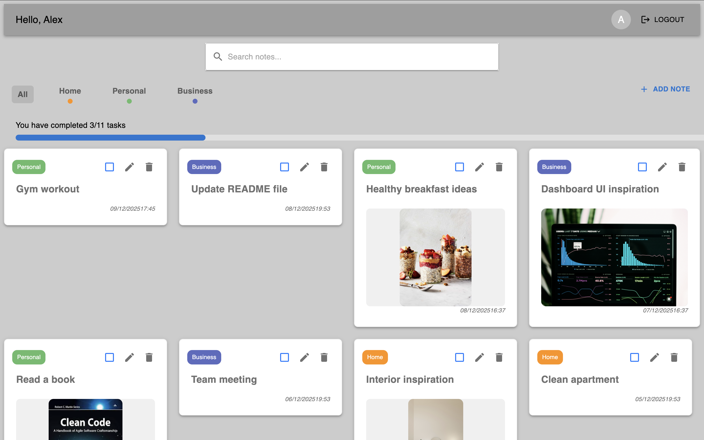
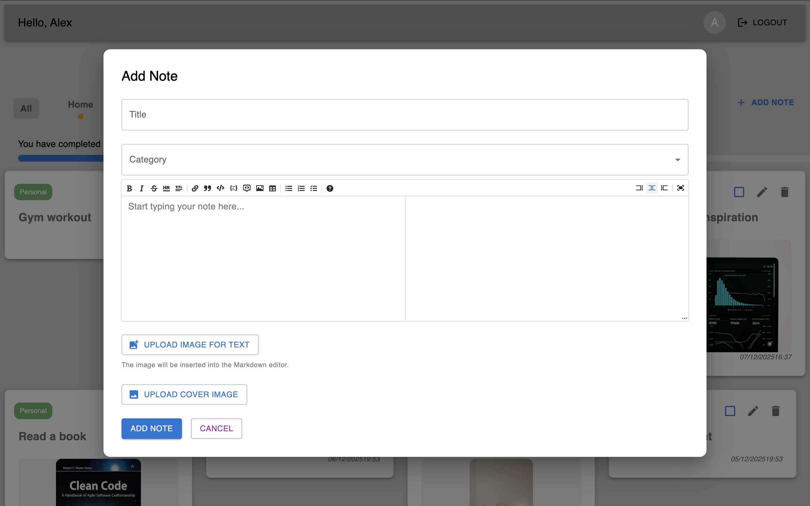

# SnapNotes — Full-Stack Notes Application

A production-ready note-taking web application built with modern full-stack architecture, featuring secure authentication, cloud storage, and real-time state management.

**Live Demo:** [snap-notes-web.netlify.app](https://snap-notes-web.netlify.app)


## 📸 Screenshots


*Main dashboard with note cards and category filtering*


*Modal interface for creating and editing notes*


*Detailed note view with image support*

---

## 🎯 Project Highlights

- **Secure Authentication** — Session-based auth with Passport.js, bcrypt password hashing
- **Cloud Storage Integration** — Image uploads to Supabase with signed URL access
- **Global State Management** — Redux Toolkit for predictable state updates
- **RESTful API Design** — Clean, protected endpoints with middleware validation
- **Modal-based UI** — Clean UX with Material-UI modals for create/edit/view operations
- **Responsive Design** — Fully responsive interface built with Material-UI components
- **Production Deployment** — Separate frontend/backend hosting with CORS configuration
- **Database Design** — Normalized PostgreSQL schema with user-note relationships

---

## 🛠 Tech Stack

### Frontend
- React + Vite
- Redux Toolkit (state management)
- Material-UI (component library)
- Custom hooks for API integration
- Deployed on **Netlify**

### Backend
- Node.js + Express
- Passport.js (authentication)
- PostgreSQL (Neon)
- Supabase Storage (image hosting)
- Session management with express-session
- Deployed on **Render**

### Security & Best Practices
- bcrypt password hashing
- Rate limiting (express-rate-limit)
- Security headers (Helmet.js)
- Input validation middleware
- Protected routes with authentication checks
- CORS whitelist configuration

---

## 🏗 Architecture
```
┌─────────────┐         HTTPS          ┌─────────────┐
│   React     │ ◄──────────────────►   │   Express   │
│  (Netlify)  │    REST API + CORS     │   (Render)  │
└─────────────┘                        └──────┬──────┘
      │                                       │
      │ Redux State                           │
      │                                       ├─► PostgreSQL (Neon)
      │                                       │
      │                                       └─► Supabase Storage
      │
   Browser
```

**Key Features:**
- Redux manages notes state with optimistic updates
- Session cookies for authentication (httpOnly, secure)
- Images uploaded to private Supabase bucket
- Signed URLs generated on-demand (1hr expiry)
- User-specific data isolation via foreign keys

---

## 🔑 Core Features

**User Authentication**
- Registration with email validation
- Secure login with session persistence
- Protected routes on both frontend and backend

**Notes Management**
- Full CRUD operations (Create, Read, Update, Delete)
- Category-based organization
- Toggle completion status
- Image attachments with cloud storage
- Real-time filtering and search
- Modal-based interface for creating, editing, and viewing notes
- Smooth UX with custom modal hooks

**State Management**
- Centralized Redux store for notes
- Custom `useNotes()` hook combining Redux + API calls
- Automatic UI updates on state changes

---

## 📡 API Design

**Base URL:** `https://note-taking-app-wovy.onrender.com`

### Authentication Routes
```
POST   /users/register     Create new account
POST   /users/login        Log in user
GET    /users/user         Get current user (protected)
GET    /users/logout       End session
```

### Notes Routes (All Protected)
```
GET    /notes              Fetch all user notes
POST   /notes              Create new note
PUT    /notes/:id          Update note
PATCH  /notes/:id/toggle   Toggle completion
DELETE /notes/:id          Delete note
GET    /notes/categories   Get categories
```

### Image Routes (Protected)
```
POST   /images/upload           Upload image (max 5MB)
GET    /images/signed-url/:id   Get temporary URL
```

---

## 🗄 Database Schema

**PostgreSQL with two schemas:**

**users.users**
- User accounts with hashed passwords
- Unique email constraint

**notes.notes**
- User-owned notes (FK to users)
- Category relationships (FK to categories)
- Optional image file references

**notes.categories**
- Predefined categories for organization

---

## 🚀 Deployment

- **Frontend:** Netlify (auto-deploy from Git)
- **Backend:** Render (Node.js service)
- **Database:** Neon (serverless PostgreSQL)
- **Storage:** Supabase (private bucket)

**Environment Configuration:**
- CORS whitelist for production origin
- Secure session cookies in production
- Rate limiting (200 req/15min)
- Proxy trust for Render deployment

---

## 💡 Technical Decisions

**Why Redux?**
- Centralized state prevents prop drilling
- Easy debugging with DevTools
- Predictable updates through reducers

**Why Session-based Auth?**
- Simpler than JWT for small-scale apps
- Automatic cookie handling
- Server-side session control

**Why Supabase Storage?**
- Easy integration with PostgreSQL
- Built-in signed URL generation
- Private bucket security

---

## 🎓 Skills Demonstrated

- Full-stack application architecture
- RESTful API design patterns
- Authentication & authorization
- Database design & relationships
- Cloud storage integration
- State management patterns
- Security best practices
- Production deployment
- CORS & session configuration

---

## 📦 Local Setup
```bash
# Backend
cd backend
npm install
npm run dev

# Frontend
cd frontend
npm install
npm run dev
```

**Required Environment Variables:**
- `DATABASE_URL`, `SESSION_SECRET`, `SUPABASE_URL`, `SUPABASE_SERVICE_ROLE_KEY`, `SUPABASE_BUCKET`, `SUPABASE_PROJ_PASS`

---
